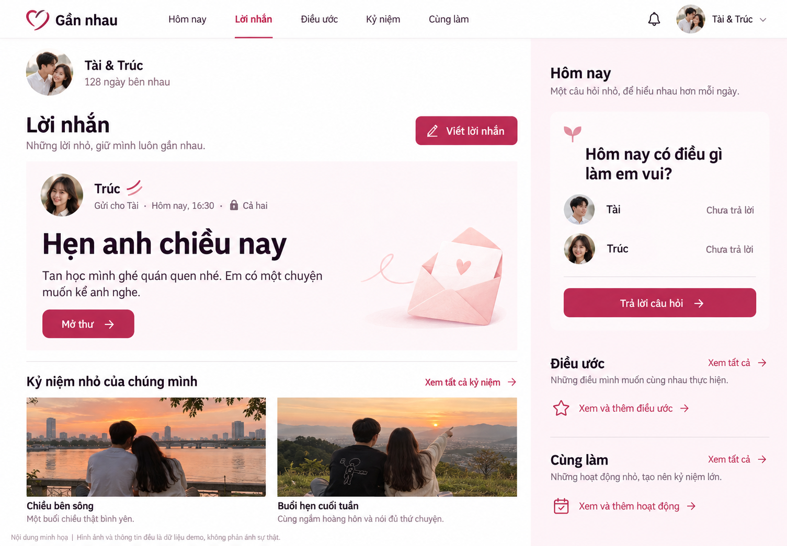
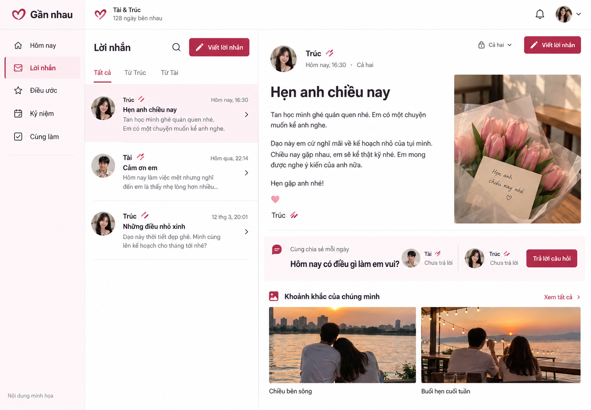
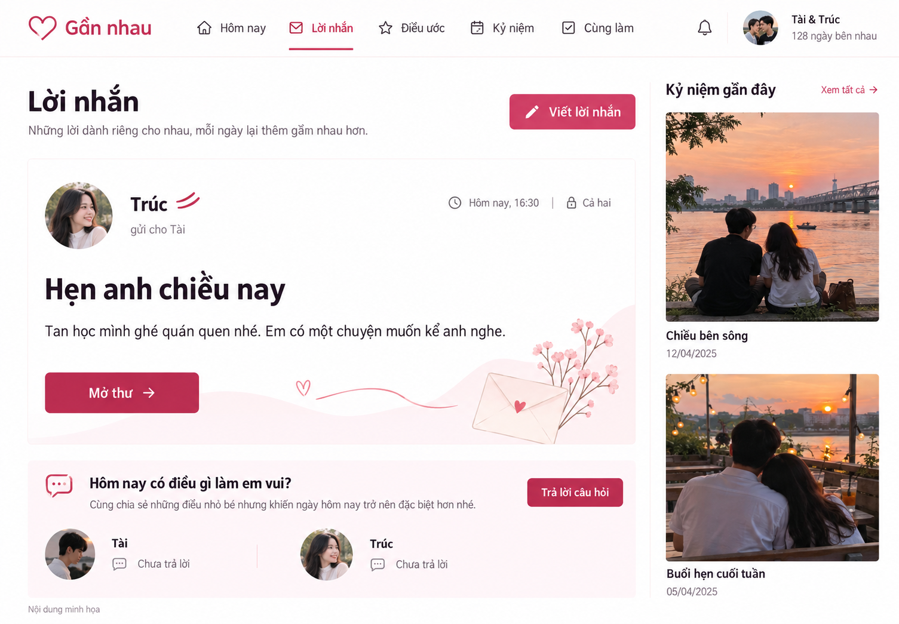

# Doita — ba mockup Hai nét

Ngày 05/10/2026. Anh chọn kết hợp mockup ảnh với bản chạy thật. Đã tạo ba phương án bằng imagegen; chưa có phương án được chốt. Đây là ảnh tham chiếu desktop, không phải screenshot của web đã triển khai. Tất cả tên, ảnh và nội dung trong ảnh là minh họa.

## A — lời nhắn dẫn Home

Lời nhắn chiếm vùng chính; daily ở cạnh; album thấp hơn. Đề xuất ưu tiên A vì sát kế hoạch đã được anh yêu cầu triển khai. Khi dựng phải giữ đúng trạng thái route Home, bỏ các đường dẫn phụ lặp cùng hành động, giữ avatar/assets theo theme và không tuyên bố người ấy chưa trả lời khi máy chủ không cung cấp trạng thái đó.

## B — hộp thư và vùng đọc

Danh sách thư đứng cạnh vùng đọc. Chưa đề xuất chốt: mockup lặp nút viết, thêm ảnh đính kèm trong lời nhắn mà chức năng hiện có không hỗ trợ, và nghiêng sang trang Notes hơn Home. Những chi tiết này không phải yêu cầu thêm tính năng.

## C — vùng đọc cạnh album

Vùng đọc lớn, daily thấp hơn, album thành dải cạnh phải. Ảnh nổi bật hơn A. Cần loại bỏ họa tiết chạy ngang vùng đọc nếu chúng tranh chú ý với chữ và giữ minh họa đúng nguồn assets.

## Quy trình tiếp theo

Impeccable `visualize.md` yêu cầu chọn hoặc giao quyền chọn sau khi thấy cả ba ảnh, trước khi viết UI. Câu hỏi chọn đã được gửi trong chat. Chưa đặt `approved: true`, chưa đóng pha comps, chưa triển khai, chưa kiểm thử UI mới.

Prompt gốc nằm trong sidecar của từng ảnh, đồng thời đã nhúng vào metadata PNG bằng `embed-prompt`. Các file gốc imagegen ở thư mục generated_images của Codex được giữ nguyên; bản dùng trong dự án được sao chép thật vào `.impeccable/mocks/`. Không dùng PNG mockup làm nền chứa chữ/nút của web.

Các ảnh trong `.impeccable/` là artifacts local; kiểm tra cấu hình Git trước khi chia sẻ, không giả định push source sẽ mang theo mockup.
